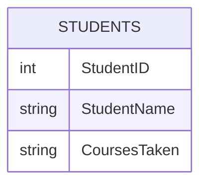
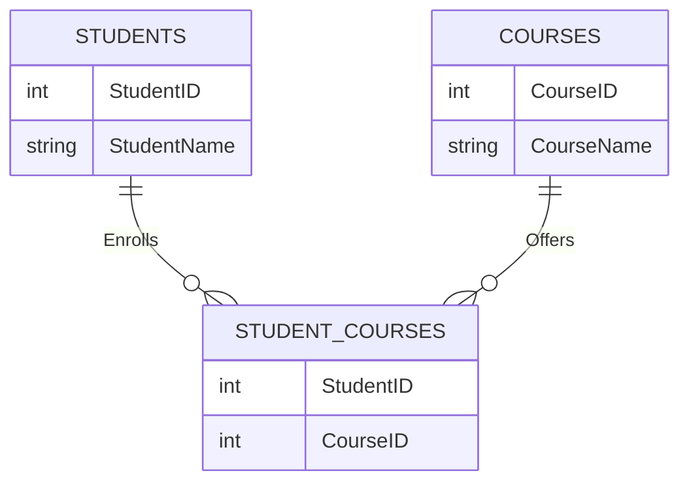

In the realm of database design, the choice between employing junction tables and storing multiple elements in rows for managing many-to-many relationships is a pivotal one. This debate isn't just about adhering to theoretical principles; it's about practicality, efficiency, and the real-world impact on application performance and maintainability. Let's delve into the nuances of this decision.

## The Core Argument Against Storing Multiple Elements in Rows

At first glance, the idea of condensing multiple elements into a single row might seem appealing for its simplicity. However, upon closer inspection, this approach reveals significant drawbacks:

1. **Data Redundancy and Integrity Issues**
   - Storing multiple elements in rows contradicts the fundamental principles of data normalization, leading to redundancy and potential inconsistencies within the data.

2. **Scalability Challenges**
   - As datasets grow, managing and querying data stored in this manner becomes increasingly difficult. The complexity of maintaining data integrity and performing efficient queries escalates exponentially.

3. **Query Performance**
   - Retrieving or manipulating data across multiple elements in a single row can be slow and resource-intensive, especially as the volume of data expands.

## Example of an Inefficient SQL Schema

Consider a schema where multiple elements are stored in rows. This example illustrates a many-to-many relationship between `Students` and `Courses`.

### Inefficient Schema

In this schema, the `CoursesTaken` field might contain a comma-separated list of course IDs. This design poses several problems, including difficulty in querying specific courses and ensuring data integrity.

## The Advantages of Junction Tables

Contrastingly, junction tables emerge as a superior solution, offering a range of benefits that address the shortcomings of storing multiple elements in rows:

1. **Adherence to Normalization Principles**
   - Junction tables align with normalization standards, ensuring that each piece of data is stored once and referenced elsewhere. This approach minimizes redundancy and maximizes data integrity.

2. **Enhanced Scalability**
   - By separating related data into distinct tables, junction tables facilitate easier management, updates, and queries. This modular structure supports growth and expansion without compromising performance.

3. **Improved Query Performance**
   - Leveraging indexes and foreign key constraints, junction tables enable SQL engines to execute joins efficiently, optimizing data retrieval and manipulation processes.

4. **Flexibility and Future-proofing**
   - Junction tables offer greater flexibility, accommodating changes in the data model with relative ease. This adaptability is crucial for evolving applications and databases.

## Converting to a Junction Table

Let's convert the inefficient schema into a normalized design using a junction table.

### Efficient Schema with Junction Table

In this improved design:
- The `STUDENTS` table stores student information.
- The `COURSES` table stores course information.
- The `STUDENT_COURSES` table acts as a junction table, linking students and courses.

This structure adheres to normalization principles, improving data integrity, scalability, and query performance.

## The Power of Bidirectional Navigation

A critical advantage of junction tables is their capacity to support both forward and backward relations, enhancing the database's navigational capabilities:

- **Forward Relations**: Navigating from one entity to another based on the relationship, facilitating direct access to related data.
- **Backward Relations**: Traversing from the second entity back to the first, enabling comprehensive data analysis and reporting based on relationships.

## Conclusion

The choice between using junction tables and storing multiple elements in rows is not merely academic; it's a practical decision with profound implications for database design, performance, and maintenance. While the initial allure of simplicity might lean towards storing multiple elements in rows, the long-term benefits of using junction tables—such as adherence to normalization principles, scalability, improved query performance, and the ability to support bidirectional navigation—make them the clear winner in managing many-to-many relationships in SQL databases.

> This analysis is intended to guide developers and database administrators in making informed decisions regarding their database designs, emphasizing the importance of choosing solutions that prioritize efficiency, scalability, and data integrity.

[Source 1](https://www.sqlshack.com/sql-server-junction-table/)
[Source 2](https://www.techrepublic.com/article/how-to-design-a-database-for-multiple-users/)